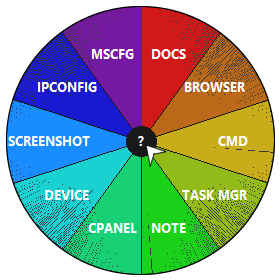

# 🖱️ Mouse Launcher 2026
**Created by Mave-rick84**

](https://www.gnu.org/licenses/gpl-3.0)

---

## 🇮🇹 Descrizione
Mouse Launcher è un piccolo launcher di forma circolare che permette l'apertura veloce di app, cartelle e link web. Scritto in **PureBasic**, è portable e veloce. 

### 🚀 Come funziona
* **Avvio:** Basta avviare il file `.exe`. Al primo avvio verrà creato automaticamente il file `mouselauncher.ini` nella stessa cartella.
* **Attivazione:** Premi il **tasto centrale del mouse (rotella)** per far comparire il menu di default.
* **Configurazione:** Premi `CTRL + ALT + S` quando il menu è visibile per entrare nella configurazione.
* **Chiusura:** Clicca al di fuori del menu per farlo scomparire, oppure premi **ESC** per killare (terminare) il processo.

### ✨ Caratteristiche
* Aggiungi, modifica o rimuovi gli "spicchi" a tuo piacimento.
* Personalizzazione di colori, font, trasparenza e altro.
* Cambio del tasto di attivazione (supporta anche i tasti "indietro" e "avanti" dei mouse che li hanno).

---

## 🇺🇸 Description
**Mouse Launcher** is a lightweight, circular radial menu designed for quick access to apps, folders, and web links. Written in **PureBasic**, it is portable, fast, and efficient.

### 🚀 How it works
* **Startup:** Simply run the `.exe` file. On the first launch, a `mouselauncher.ini` file will be automatically created in the same folder.
* **Activation:** Press the **middle mouse button (scroll wheel)** by default to toggle the menu.
* **Settings:** Press `Ctrl + Alt + S` while the menu is visible to enter the configuration panel.
* **Close/Exit:** Click anywhere outside the menu to hide it, or press **ESC** to terminate the process.

### ✨ Key Features
* **Fully Customizable:** Add, edit, or remove "slices" as you like.
* **Visual Personalization:** Change colors, fonts, transparency levels, and more.
* **Mouse Support:** You can change the activation trigger; it supports standard buttons as well as **Back** and **Forward** buttons for advanced mice.

### 📥 Download
Puoi scaricare l'ultima versione compilata (eseguibile) qui:
[**Scarica Mouse Launcher v1.0.0**](https://github.com/Mave-rick84/MouseLauncher/releases/latest)

## ⚖️ License & Copyright 
Licensed under **GPLv3**. Copyright (c) 2026 by Mave-rick84
 📧 Email: <atdragon120@protonmail.com>
